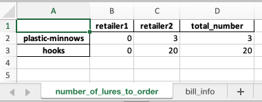

# Online retail optimizer


## Intro
Have you ever online shopped and tried to decide: is it better to buy my items from retailer 1, retailer 2, retailer 3, ... or split my order between them?  Dividing an order amongst retailers can allow you to capitalize on cheaper prices for certain goods at some retailers, but it can increase your shipping costs. What's the optimal way to split a purchase across retailers to minimize the total bill? This program solves that problem.

### Problem Description

This program applies to the following very common online retail situation:
1. You are purchasing 1 or more (integer) quantities of several different products.
1. There are multiple online retailers selling the products.
1. Prices of items are (generally) different at different retailers.
1. Shipping prices are (generally) different at different retailers.
1. If your subtotal at a retailer exceeds a threshold, you qualify for free shipping. Thresholds (generally) differ between retailers.

You must decide how many (integer) units of each item to order from each retailer, so that your total bill is minimized. (In other words, you decide how to divide your order amongst retailers, to minimize the total price.)  Your bill can be reduced by taking full advantage of cheaper shipping and cheaper unit prices.  

### Solution

The file [retailoptimizer.py](retailoptimizer.py) provides reusable code to solve this problem.  

The notebook [Notebook.ipynb](Notebook.ipynb) provides examples of using the code.

There are two interfaces available to input data to specify an order to optimize:
1. Python code
1. An Excel spreadsheet.  Example Excel files are included in the [examples](examples) folder, and a detailed explanation is given in [docs/Excel.md](docs/Excel.md).

## Installation:

1. Clone this repo and cd inside
1. Create a Conda environment with dependencies:
   ```shell
   conda env create -f environment.yml
   ```
1. Activate the environment
   ```shell
   conda activate pulp
   ```

## Solve via command line interface
1. Optionally, edit the file [examples/sample-order-small.xlsx](examples/sample-order-small.xlsx). (You can also make a copy and fill in your own problem parameters.)
1. Solve the problem:
   ```shell
   python retailoptimizer.py -i examples/sample-order-small.xlsx -o examples/sample-order-small_results.xlsx
   ```

In the generated output file [examples/sample-order-small_results.xlsx](examples/sample-order-small_results.xlsx), you will find the solution. In this case, the optimal solution is to order all items from Retailer2, and order nothing from Retailer1.  


For more details, and a more complex example where the order is divided between retailers, read the supplemental documentation [docs/EXCEL.md](docs/EXCEL.md)

## Solve via Jupyter Notebook
Check out the notebook [Notebook.ipynb](Notebook.ipynb) for further examples of using the code to solve optimization problems.
1. Start jupyter lab:
   ```shell
   jupyter lab
   ```
1. Open [Notebook.ipynb](Notebook.ipynb) and run all cells.

## Supplemental documentation
1. A detailed walkthrough of the longer sample problem is given in [docs/EXCEL.md](docs/EXCEL.md).
1. For further info about the math formulation of the problem (for math lovers only), see [docs/MATH.md](docs/MATH.md).

